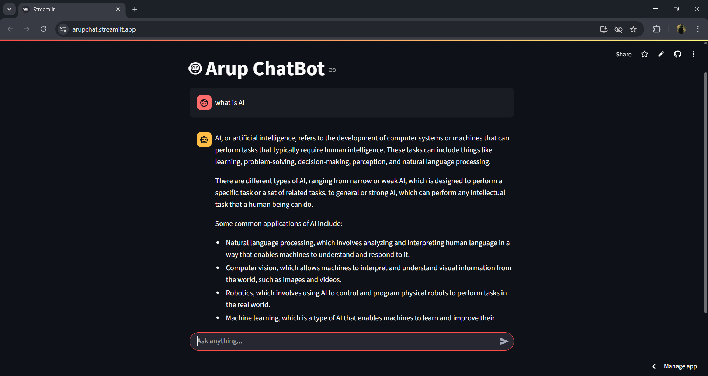

# 🤖 Arup ChatBot - Hugging Face API + Streamlit

This is a simple chatbot app built using the Hugging Face `Mixtral` model and deployed with **Streamlit Cloud**. It allows users to ask any question and get real-time AI responses.

---

## 🧠 Tech Stack

- **Frontend:** Streamlit
- **Backend:** Hugging Face Inference API (`mistralai/Mixtral-8x7B-Instruct`)
- **Language:** Python
- **Hosting:** Streamlit Cloud

---

## 🚀 Demo

👉 [Click here to try the chatbot]()

*(Replace with your actual Streamlit Cloud URL)*

---

